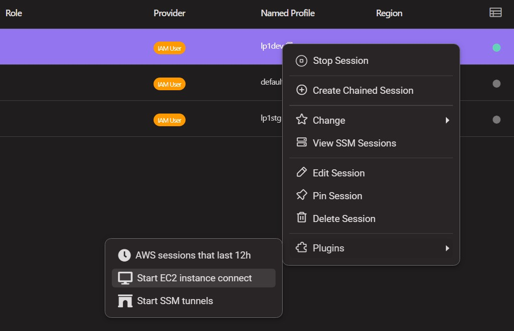

# [Leapp](https://www.leapp.cloud) EC2 Instance Connect Plugin</h1>

## Introduction

This plugin aims to help developers and AWS users in general for remoting and forwarding into EC2 instance!
This plugin source code inspiration ~~(copied)~~ based on:

`https://github.com/christian-calabrese/leapp-ssm-tunnels-plugin`

## How it works?

The plugin uses this command `aws ec2-instance-connect send-ssh-public-key` to upload SSH public key to EC2 instance. Then SSH-ing (remote/forward) to EC2 instance.

## Plugin in action!

It's possible to install and use this plugin as well explained by the Noovolari team throughout the Leapp's documentation that you can find here:
[Leapp plugins introduction](https://docs.leapp.cloud/0.17.0/plugins/plugins-introduction)

## How to install?

1. Open Settings (⚙)
2. Click Plugins
3. Type `leapp-ec2-instance-connect-plugin` in `Insert an npm package name`
4. Click plus icon (⊕)


## How to configure the plugin?

This plugin makes use of a json configuration file (`ec2-connect-config.json`) where you can specify the parameters needed to establish the tunnel.

You can use the below example to create your own file and place it in the Leapp installation folder (usually in `$HOME` (macos/linux/powershell) or `%USERPROFILE%` (windows/CMD) user directory).

For example:

`$HOME/.Leapp/ec2-connect-config.json`

You can find an example of such file in this repository called `ec2-connect-config.example.json`

```json
[
  {
    "sessionName": "Session1",
    "availabilityZone": "ap-southeast-1c",
    "instanceId": "i-0abcdefghijkl1234",
    "instanceOSUser": "ec2-user",
    "instanceIPAddress": "8.8.8.8",
    "sshPath": "/home/username/.ssh",
    "sshPublicKeyFile": "id_ed25519.pub",
    "sshPrivateKeyFile": "id_ed25519",
    "modeType": "remoting/forwarding",
    "mode": "forwarding",
    "configs": [
      {
        "remoteHost": "ec2instancename.xxxx.ap-southeast-1.rds.amazonaws.com",
        "remotePort": "3306",
        "localPort": "3307"
      }
    ]
  },
  {
    "sessionName": "Session2",
    "availabilityZone": "ap-southeast-1c",
    "instanceId": "i-0abcdefghijkl1234",
    "instanceOSUser": "ec2-user",
    "instanceIPAddress": "8.8.8.8",
    "sshPath": "/home/username/.ssh",
    "sshPublicKeyFile": "id_ed25519.pub",
    "sshPrivateKeyFile": "id_ed25519",
    "modeType": "remoting/forwarding",
    "mode": "remoting"
  }
]
```

## How to use?

Configure the plugin (see `How to configure the plugin?` section)


